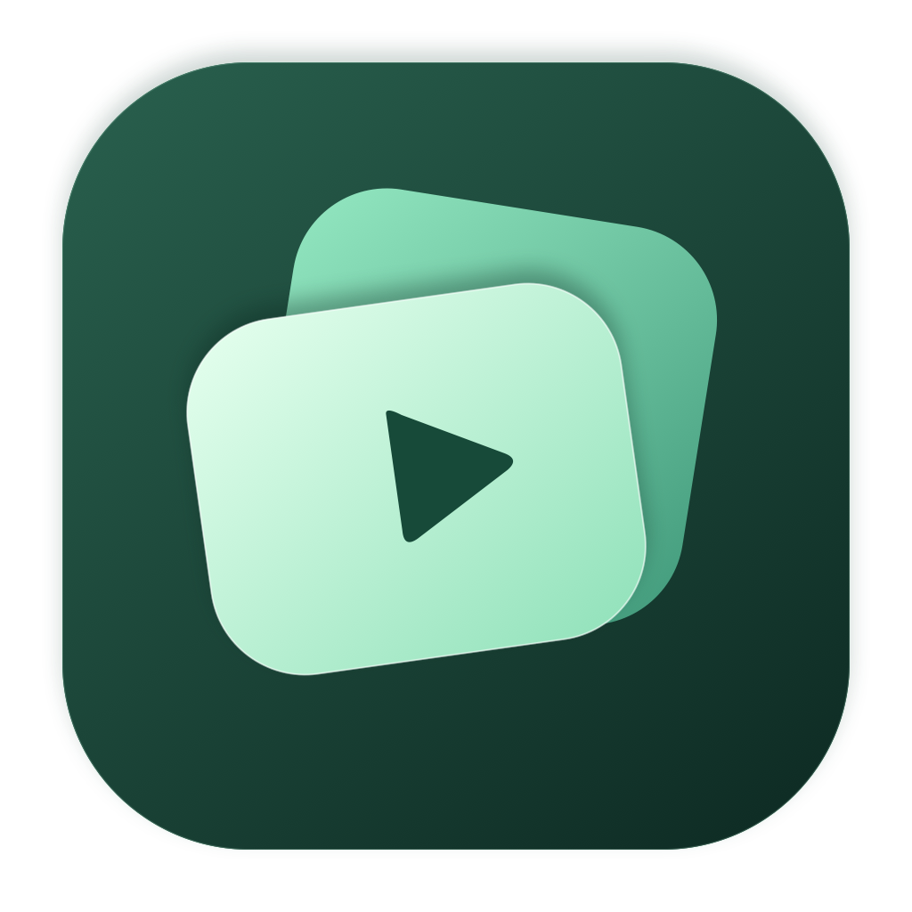
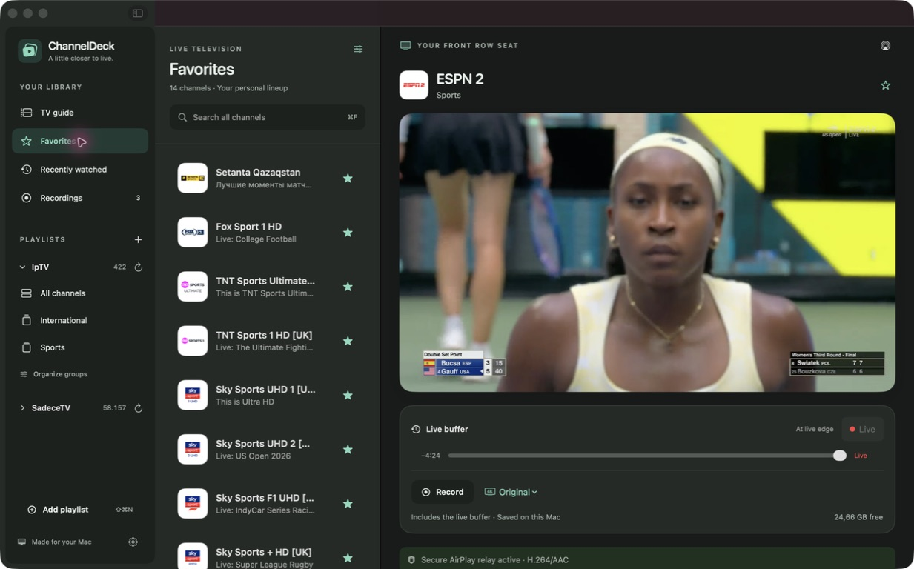
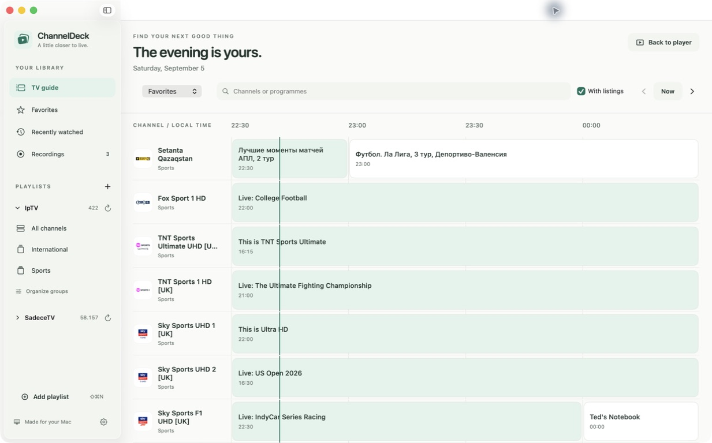
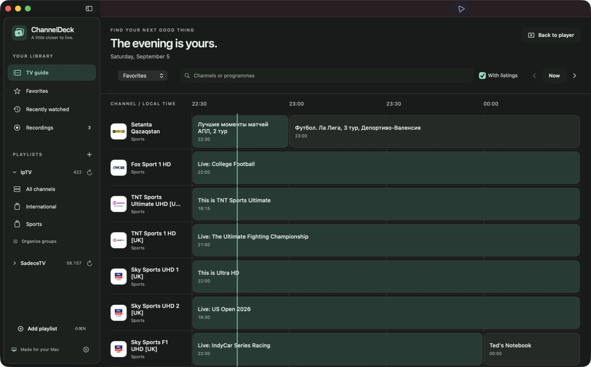
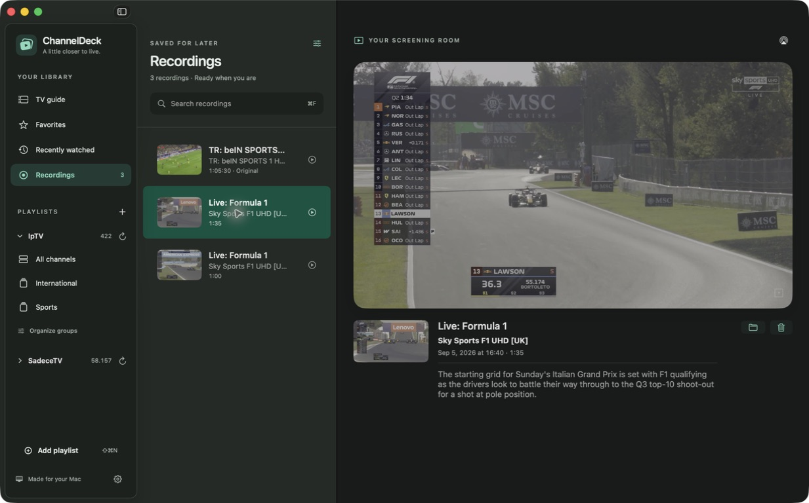
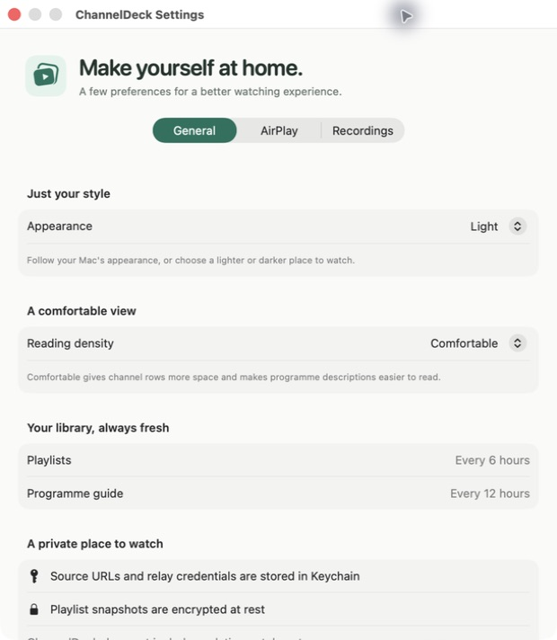
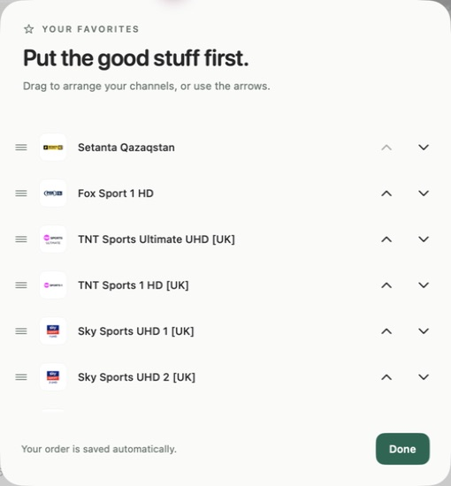

<p align="center">
  
</p>

<h1 align="center">ChannelDeck</h1>

<p align="center">
  Your front row seat to live TV on macOS.<br>
  A searchable TV guide, live rewind, local recording, and AirPlay.
</p>

<p align="center">
  <strong>macOS 15+</strong> · <strong>Swift 6</strong> · <strong>SwiftUI</strong> · <strong>AVFoundation</strong>
</p>

ChannelDeck brings your M3U playlists together in a native Mac TV library. A mint and forest palette, an original overlapping-screen identity, and carefully spaced light and dark appearances give live TV a calmer home. Browse a large collection, find something in the guide, rewind a moment, or save it for later—all in SwiftUI with native AVFoundation playback.

ChannelDeck does **not** include channels, playlists, subscriptions, or credentials. Bring a playlist you are authorized to use; sensitive source URLs are stored in the macOS Keychain rather than in the project or ordinary app preferences.



## A closer look

| TV guide · light | TV guide · dark | Saved recordings |
| --- | --- | --- |
| [](docs/screenshots/guide-light.jpg) | [](docs/screenshots/guide-dark.jpg) | [](docs/screenshots/recordings.jpg) |

<details>
<summary>Make it yours: appearance, reading density, and favorite order</summary>
<p>
  
  
</p>
</details>

Screenshots show the current source build using an existing library. Channel logos, programme listings, and broadcast images belong to their respective owners; none of this content is included with ChannelDeck.

## Highlights

### Browse without friction

- Add and manage multiple HTTP or HTTPS M3U playlists.
- Search for channels globally across every playlist and group.
- Navigate very large channel libraries with indexed search, lazy rows, and shared logo caching.
- Keep favorites and recently watched channels close at hand.
- Refresh playlists independently from their sidebar headings.
- Explore a full-width XMLTV timeline with two-hour pages, programme search, playlist filters, and live playback from programme details.
- Search the guide in the background using a reusable, normalized snapshot. Briefly debounced queries cancel superseded work and keep the previous results visible while the next match is prepared.
- Hide unwanted groups, filter long group lists, and drag favorites into your preferred order. These choices are saved automatically.
- Choose comfortable or compact channel rows, with matching programme text sizes, and System, Light, or Dark appearance.
- See immediate connection progress, cancel a pending tune-in, and refresh a missing stream directly in the player.

### Watch live TV like live TV

- Play through macOS-native AVKit and AVFoundation controls.
- Use fullscreen, Picture in Picture, system media controls, and AirPlay.
- Rewind within a five-minute rolling live window and jump back to the live edge.
- Automatically prepare H.264/AAC compatibility media for HEVC, UHD, raw MPEG-TS, and video-only sources.
- Continue playing ordinary compatible streams without routing them through an embedded web view.

### Keep what you were watching

- Choose **Record** to retain the history already available in the live window and continue recording.
- Follow the red recording timer and available disk space. Let the recording grow until you stop it or change channels; ChannelDeck does not impose a recording-duration limit.
- Choose **Original Video** to preserve the source video resolution and HDR, or **Compatible 1080p** for broader Apple-device playback.
- Store recordings locally with programme title, description, channel details, duration, quality, and an automatically generated thumbnail.
- Play recordings inside ChannelDeck, reveal them in Finder, or delete them from the library.

> [!NOTE]
> Recording length is not capped by ChannelDeck, but available disk space, provider continuity, and the Mac remaining awake still apply.

## Install a test build

Download the DMG and checksums from the [v0.1.0 testing release](https://github.com/cevatkerim/ChannelDeck/releases/tag/v0.1.0). Release access follows the repository's visibility and permissions.

> [!IMPORTANT]
> The v0.1.0 package predates the redesign and TV guide shown above. [Build the current source](#build-from-source) for the latest interface and guide search improvements.

The DMG packaging workflow targets **Apple Silicon Macs running macOS 15 or newer**. It includes FFmpeg, so installing the packaged app does not require Xcode or Homebrew. This is an **unsigned, unnotarized testing build**; macOS will warn that Apple cannot verify its developer.

Open the DMG, drag **ChannelDeck** into **Applications**, then open the installed app. If macOS blocks it and you trust the build, use **System Settings → Privacy & Security → Open Anyway** and confirm the prompt. See [Apple's instructions](https://support.apple.com/guide/mac-help/open-a-mac-app-from-an-unknown-developer-mh40616/mac). A managed Mac may not permit this exception.

See the [distribution guide](docs/distribution.md) for building a DMG locally, verifying it, and the future signing and notarization process. A local build does not automatically publish a GitHub release.

## Build from source

### Requirements

- macOS 15 or newer
- Xcode 16 or newer with Swift 6
- [XcodeGen](https://github.com/yonaskolb/XcodeGen) only when regenerating the project after editing `project.yml`
- FFmpeg 7 or newer for live-buffer, recording, and AirPlay compatibility workflows during development

Install FFmpeg with Homebrew:

```sh
brew install ffmpeg
```

The DMG workflow builds its own LGPL FFmpeg executable from pinned source and bundles it inside the application; it does not redistribute your Homebrew installation.

### Quick start

1. Clone the repository.
2. Open `ChannelDeck.xcodeproj` in Xcode.
3. Select the **ChannelDeck** target and choose your development team under **Signing & Capabilities**.
4. Build and run the **ChannelDeck** scheme.
5. Choose **Add Playlist**, give the source a name, and enter its M3U URL.

ChannelDeck discovers an XMLTV guide URL from the playlist's `url-tvg` metadata when available. You can also enter a separate EPG override while adding the playlist.

HTTP sources are supported for compatibility with legacy IPTV providers. App Transport Security is relaxed only for AVFoundation media loading; ChannelDeck separately validates playlist, guide, redirect, and relay requests. Credential-bearing network errors are reduced to safe user-facing messages.

## Find your next watch

Open **TV guide** to browse a two-hour timeline. Choose **Favorites**, **All playlists**, or an individual playlist, then search by channel or programme. **With listings** hides channels without guide entries in the visible window. Use the arrows to look ahead and **Now** to return to the current broadcast window. Select a programme for details and **Watch live** to tune into its channel.

Guide matching runs away from the main UI thread over immutable search data. The index is refreshed when the catalogue or EPG changes, rather than rebuilt for every keystroke. Automated tests exercise 60,000 channels and 360,000 programmes, including cancellation and stale-result protection.

To simplify your library, choose **Organize groups** beneath a playlist. Hidden groups remain available to restore, and their starred channels stay accessible in Favorites. In **Favorites**, open the display menu and choose **Arrange favorites…** to drag channels into order. Appearance and comfortable or compact reading density are available in **Settings → General**.

| Shortcut | Action |
| --- | --- |
| `⌘1` / `⌘2` / `⌘3` | Favorites / TV guide / Recordings |
| `⌘F` | Focus search |
| `⇧⌘N` | Add a playlist |
| `⌘R` | Refresh the selected playlist |
| `Space` | Play or pause |
| `⇧⌘R` | Start or stop recording |
| `⌥⌘R` | Retry playback |
| `⌘.` | Stop playback |

## Live buffer and recording

When a source uses the compatibility pipeline, ChannelDeck publishes a local rolling HLS rendition. The default window contains up to five minutes of completed media segments, which enables the timeline below the player.

To record what you are watching:

1. Wait for **Live Buffer** to appear.
2. Select **Original** or **Compatible** beside **Record**.
3. Choose **Record**. Existing complete segments in the live window are adopted immediately.
4. Keep watching. New completed segments are appended until you choose **Stop recording** or select another channel. The timer includes the retained live buffer.
5. Open **Recordings** in the Library to play, reveal, or remove the result.

**Original Video** copies the source video without re-encoding and converts audio to AAC for dependable Apple playback. **Compatible 1080p** saves the H.264/AAC AirPlay rendition and generally uses less space. A video-only provider stream is paired with silent AAC so it remains usable by Apple playback and AirPlay components that require both tracks.

## Secure AirPlay relay

Direct AirPlay hands the media URL to the receiver. A provider that redirects to plain HTTP may therefore work on the Mac while failing on Apple TV. ChannelDeck's optional relay gives the receiver a publicly trusted HTTPS URL while media stays on the local network.

### Set up the relay

1. In Cloudflare, create an API token scoped to the desired zone with **Zone DNS Edit** and **Zone Read** permissions.
2. In ChannelDeck Settings, enter the zone domain, optional Cloudflare account ID, and API token.
3. Keep **Production (trusted)** selected for Apple TV. The staging environment validates ACME and DNS setup but is intentionally not trusted by receivers.
4. Choose **Set Up Relay**.

ChannelDeck then:

- detects the current RFC 1918 LAN address;
- creates a unique, DNS-only `iptv-xxxxxxxx` A record;
- completes a Let's Encrypt DNS-01 challenge;
- starts a local HTTPS listener with the issued certificate; and
- exposes only opaque, expiring session paths to the receiver.

The API token and certificate key material stay in Keychain. DNS records carry an installation-specific ownership comment, and **Reset** removes only the record owned by that installation. Upstream source URLs are never included in receiver-facing paths, subprocess arguments, or user-facing error messages.

### Media compatibility

For compatible inputs, ChannelDeck copies H.264 video and converts the first audio track to 48 kHz stereo AAC. HEVC and other incompatible video codecs are converted with Apple's VideoToolbox H.264 encoder and capped at 1080p for the AirPlay rendition. Original-quality recording remains a separate choice.

Continuous MPEG-TS sources are streamed through a bounded pipe instead of exposing provider URLs to FFmpeg. The Mac must remain awake and on the same LAN as the AirPlay receiver. Some routers block public hostnames that resolve to private addresses; if DNS-rebinding protection intervenes, allow the generated relay hostname in the router configuration.

ChannelDeck searches for FFmpeg in this order:

1. an auxiliary executable bundled with ChannelDeck;
2. `/opt/homebrew/bin/ffmpeg`;
3. `/usr/local/bin/ffmpeg`.

## Privacy and security

- Playlist URLs and relay credentials are stored in macOS Keychain.
- The last-known-good playlist snapshot is encrypted with a Keychain-backed key before being written to Application Support.
- Provider URLs are not passed to FFmpeg as command-line arguments.
- Redirects and internal relay paths are validated before use.
- Relay sessions use opaque, expiring identifiers.
- The repository contains no bundled playlist, account, API token, or media service.

Recordings are saved locally under ChannelDeck's Application Support directory and are never uploaded by the app.

## Development

Regenerate the Xcode project after changing `project.yml`:

```sh
xcodegen generate
```

Build without code signing:

```sh
xcodebuild -project ChannelDeck.xcodeproj -scheme ChannelDeck \
  -derivedDataPath .xcode-derived CODE_SIGNING_ALLOWED=NO build
```

Run the test suite:

```sh
xcodebuild -project ChannelDeck.xcodeproj -scheme ChannelDeck \
  -derivedDataPath .xcode-derived -destination 'platform=macOS' \
  CODE_SIGNING_ALLOWED=NO test
```

The test suite covers playlist and guide parsing, large-library guide search, search cancellation, timeline bounds, library preferences, playback selection and recovery, network and redirect policy, encrypted persistence, recording storage, player state, relay routing, HLS rewriting, MPEG-TS streaming, Cloudflare DNS, ACME certificate setup, and FFmpeg compatibility behavior. Opt-in tests that require live services are skipped by default.

The app icon and interface symbol are original, reproducible artwork. See the [identity notes](docs/brand/README.md), or regenerate the assets with:

```sh
swift Scripts/render-brand.swift
```

## Project structure

| Path | Responsibility |
| --- | --- |
| `ChannelDeck/App` | Application lifecycle, state, and orchestration |
| `ChannelDeck/Core` | Secret-free domain values, search snapshots, and library preferences |
| `ChannelDeck/UI` | Native SwiftUI views and design system |
| `ChannelDeck/Playback` | AVPlayer integration, native player view, and AirPlay picker |
| `ChannelDeck/Recording` | Local recording packages and thumbnails |
| `ChannelDeck/Services` | M3U and XMLTV parsers |
| `ChannelDeck/Networking` | HTTP policy, redirects, compression, and Cloudflare DNS |
| `ChannelDeck/Relay` | HTTPS HLS relay, media compatibility, and LAN discovery |
| `ChannelDeck/ACME` | Let's Encrypt DNS-01 issuance and certificate storage |
| `ChannelDeck/Security` | Keychain access and encrypted playlist cache |
| `ChannelDeck/Persistence` | SwiftData records |
| `ChannelDeckTests` | Unit, integration, and opt-in live tests |
| `Scripts` | Brand asset generation, FFmpeg builds, and DMG packaging |
| `docs/brand` | Original identity artwork and reproduction notes |
| `docs/screenshots` | Current app screenshots |
| `docs/distribution.md` | Test installation, release verification, and signing roadmap |

See [`plan.md`](plan.md) for the original implementation specification and explicit v1 boundaries.

## Contributing

Issues and focused pull requests are welcome. Please keep provider credentials and private playlist URLs out of bug reports, screenshots, test fixtures, logs, commits, and process arguments. Run the test suite before submitting a change.

## License

ChannelDeck is source-available under the [PolyForm Noncommercial License 1.0.0](LICENSE.md). You may use, modify, and distribute it for permitted noncommercial purposes; commercial use is not granted by this license.

Because the license restricts commercial use, ChannelDeck is intentionally described as **source-available**, not OSI-approved open-source software.

The packaged app uses a separate [FFmpeg](https://ffmpeg.org) executable under **LGPL 2.1 or later**. ChannelDeck's noncommercial restriction does not apply to FFmpeg or other third-party dependencies, which retain their own licenses. The distribution workflow includes dependency notices and the corresponding FFmpeg source and build instructions; keep these with any redistributed build. See [FFmpeg's licensing information](https://ffmpeg.org/legal.html) and the [distribution guide](docs/distribution.md).
