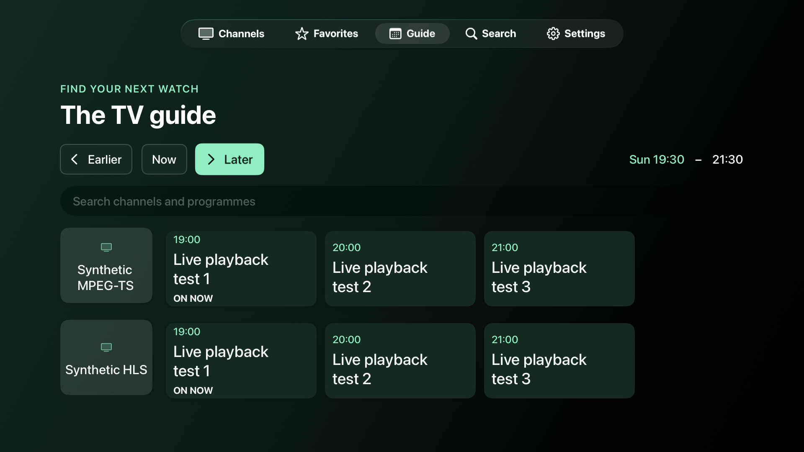
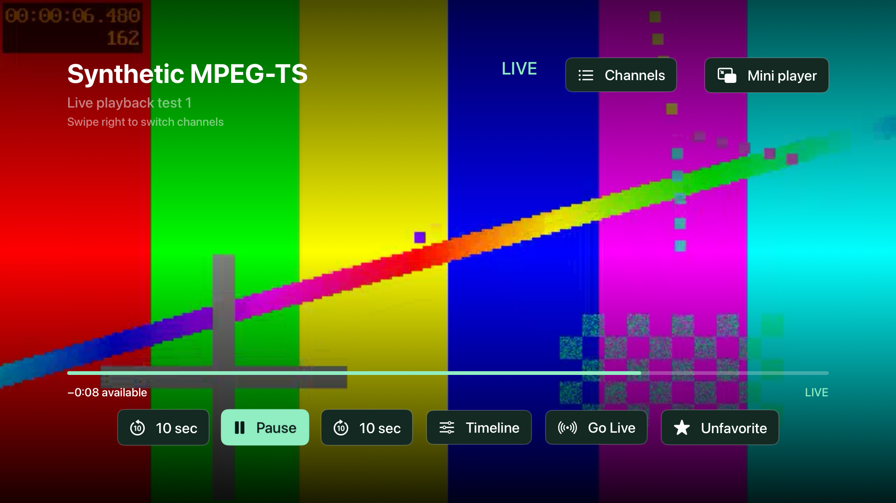
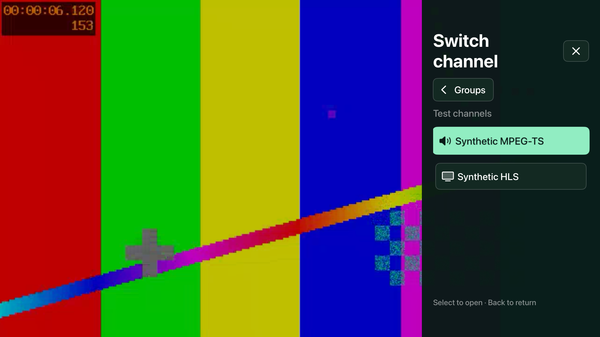
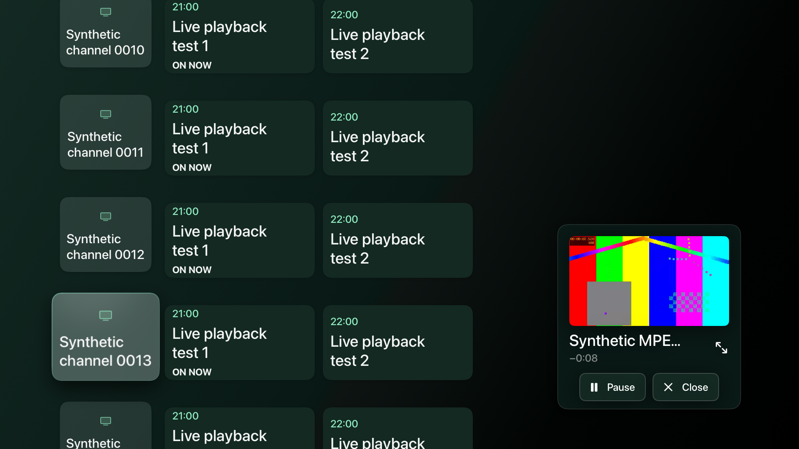

# ChannelDeck for Apple TV

ChannelDeckTV is a standalone SwiftUI application for tvOS 18 or later. It shares the Mac app’s M3U/XMLTV parsers, channel identifiers, search indexes, Keychain storage, encrypted playlist cache, and Open-EPG matching. Playback runs entirely on Apple TV using embedded FFmpeg libraries and Apple’s synchronized sample-buffer video/audio renderers. The Mac is needed for development and installation, not ordinary playback.

## Build and install

Requirements: Xcode with the tvOS SDK, an Apple TV simulator runtime for simulator tests, XcodeGen, and an Apple account configured in Xcode. The initial FFmpeg build downloads the pinned source archive and compiles both device and simulator arm64 libraries.

```sh
bash Scripts/build_ffmpeg_tvos.sh
xcodegen generate
open ChannelDeck.xcodeproj
```

Select **ChannelDeckTV**, select your Apple TV, and choose your Personal Team under **Signing & Capabilities**. Pair the device in **Window → Devices and Simulators** while Apple TV is on the same network and showing **Settings → Remotes and Devices → Remote App and Devices**. Run the app in Xcode. Team IDs, certificates, profiles, and playlist credentials are not included in project generation.

For command-line builds, pass your own team and device IDs:

```sh
xcodebuild -project ChannelDeck.xcodeproj -scheme ChannelDeckTV \
  -destination 'id=YOUR_APPLE_TV_UDID' -derivedDataPath .xcode-derived-tv \
  DEVELOPMENT_TEAM=YOUR_TEAM_ID -allowProvisioningUpdates build
```

Personal Team provisioning expires seven days after issuance; rebuild and reinstall when it expires. See [Apple’s current account limits](https://developer.apple.com/help/account/basics/about-your-developer-account/).

## Use the app

Add your M3U address in **Settings → Add playlist** using the system keyboard or the iPhone keyboard notification. The app has Channels, Favorites, Guide, Search, and Settings tabs. Movie/series entries are filtered out of this initial live TV version. Hold a channel to favorite it. Recently watched channels appear on the Channels tab.

Guide choices are **Automatic**, **Open-EPG**, and **Playlist / custom URL**. Automatic supplements missing provider listings with Open-EPG. Open-EPG uses the existing country detection, exact-ID/normalized-name matching, and fuzzy suggestions. Uncertain suggestions require a choice in **Settings → Guide matches**. Manual selections and disabled matches persist. Public feeds share a 24-hour cache; unavailable feeds do not erase current cached listings. Initial international guide imports can take several minutes.

The guide has a group filter and continuous vertical scrolling. Reusable list rows and fixed row heights keep large libraries responsive; programme ranges are prepared off the main actor. Earlier/Now/Later change the time window.



While playing:

- Centre-click or press Down to reveal controls. Move Left/Right between actions.
- With controls hidden, swipe or press Right to open the channel drawer. Choose a group or Favorites, then scroll up/down through its channels. Groups and channels use continuous scrolling. Back returns to groups, then closes the drawer. The Channels button opens the same drawer.
- Choose Mini player to browse the library or guide while watching in the lower-right corner. Select the preview to return to fullscreen, or use its Pause and Close buttons. Play/Pause on the remote works while browsing. Minimizing and expanding keep the same stream, playback position, and rewind history; choosing another channel starts a new buffer.
- Play/Pause on the remote controls playback directly.
- Use the ten-second buttons, or select Timeline and adjust with Left/Right in ten-second steps, then select Play here. Play here also resumes a paused viewer.
- Go Live returns to the most recent captured media.
- Back cancels timeline adjustment, then hides controls; Back with controls hidden returns to the library.







The mini player stays inside ChannelDeck. Playback still stops when leaving the app. System Picture in Picture over Home or other apps is not included: Apple confirms that the sample-buffer PiP path is unavailable on tvOS despite its API annotations ([Apple Developer Technical Support](https://developer.apple.com/forums/thread/830764)).

## Channel previews and Top Shelf

Channel cards use recent decoded broadcast frames with the playlist’s channel logo composited over the picture. Capture starts after video arrives, refreshes approximately every 30 seconds during live viewing, and ignores black transition frames. Pausing or rewinding suspends preview updates until returning to live. Provider packets arriving ahead of playback do not suppress capture. No extra channel streams are opened to make previews. Preview captions show only the programme title from guide data at capture time. If it is unavailable, no caption or strip appears; dates, times and “Preview” placeholders are never displayed. Capture times remain internal for expiry. After 24 hours, or before a channel has been watched, the card uses a logo fallback. Existing cached previews are recomposed to remove older timestamp captions. A generic TV mark appears when no usable logo is supplied.

The Channels tab icon uses monochrome template rendering so it follows the same focused and unfocused tint as the other native tabs. Cards use consistent 16:9 artwork, native tvOS card focus, system text styles, safe margins, and a contrasting title background only when needed. Channel names reserve two lines at the standard headline size, with a smaller group label beneath them; exceptionally long names truncate in the middle to retain their beginning and suffix. Simulator review with the real beIN Sports 1–5 and MAX 1/2 entries confirmed visible channel numbers, HD/SD variants, and smooth grid focus. Card labels share one continuous rounded shape for their background, clipping, focus effect, and context-menu preview, preventing the system platter from showing through mismatched corners. Caption backgrounds use an explicit rectangle beneath the artwork mask. These focused and unfocused states were visually checked in the simulator. In-app captions remain native text for legibility and accessibility; Home Screen artwork uses the system font with inset, truncated titles. See [Apple’s tvOS design guidance](https://developer.apple.com/design/human-interface-guidelines/designing-for-tvos) and [Top Shelf guidance](https://developer.apple.com/design/human-interface-guidelines/top-shelf).

The Channels tab’s **Your top shelf** row and the native Apple TV Home Screen share up to six frequently watched channels and six favorites, without duplicates. Tune counts rank frequently watched channels, with recency breaking ties; older saved libraries migrate without losing setup or favorites. Keep ChannelDeck in the first row of the Home Screen, highlight its icon, then move up into the shelf. Selecting a tile or pressing Play opens its channel directly, including after a cold launch.

The `ChannelDeckTVTopShelf` extension reads an atomic, credential-free manifest and composited images from an App Group cache. Deep links contain opaque channel identifiers; provider addresses and credentials remain in the main app. The extension does not open streams or download provider data. Logo downloads run with at most three concurrent requests. Thumbnail, raw-frame, and logo files share a 64 MiB cache limit; decoded logo data has a separate 16 MiB memory limit. Cached media is disposable and favorites/source setup remain in preferences and Keychain.

Both targets use `group.com.kerimincedayi.ChannelDeckTV.shared`. When first configuring signing, select the same team for the app and extension in Xcode’s Signing & Capabilities panel and let it register the checked App Group. A command-line build alone may generate an empty App Groups entitlement until this registration completes. If adapting the app under another identifier, update the group in both `TVShelfStore.swift` and `ChannelDeckTV.entitlements`. See [Apple’s tvOS capabilities](https://developer.apple.com/help/account/reference/supported-capabilities-tvos/) and [Top Shelf extension documentation](https://developer.apple.com/documentation/tvservices/building-a-full-screen-top-shelf-extension).

## Buffer and storage

The default history is ten minutes, with a five-minute option in Settings. Capture starts on tuning and runs independently of decoding, so pausing or rewinding continues recording incoming compressed packets into rotating disk chunks. Each video chunk starts at a keyframe. Seeking flushes decoder and renderer state, reads from the preceding keyframe, and discards pre-target decoded samples before resuming the synchronized render clock.

The ring has a 2 GiB payload limit and reserves 512 MiB of free device storage. Storage pressure evicts older chunks and shortens the visible rewind range. A pause that outlasts retained history resumes at the oldest available point with an explanation. Changing channels, stopping, or leaving the app clears temporary media; startup also removes interrupted session remnants. Connection recovery and incompatible timeline discontinuities start a fresh history window.

The buffer only contains media received after tuning. It cannot retrieve earlier broadcasts. High-bitrate sources may retain less than ten minutes. The UI shows the actual range and offset behind live.

Small library preferences use UserDefaults with a 400 KiB encoded limit, leaving headroom under tvOS’s defaults limit. Source addresses and cache encryption keys use Keychain. Downloaded playlists, guide listings, logos, and live media are disposable caches; losing them does not remove source setup or favorites. HTTP and HTTPS source URLs are validated explicitly. Errors do not expose provider addresses. Open-EPG matching runs locally and only public feed requests go to Open-EPG.

## Reproducible tests

Start the synthetic local fixture in one terminal. This uses the Mac’s FFmpeg executable solely to generate test patterns and audio for tests:

```sh
python3 Scripts/tvos_fixture_server.py
```

In another terminal, choose an installed tvOS simulator and run:

```sh
xcodebuild -project ChannelDeck.xcodeproj -scheme ChannelDeckTV \
  -destination 'platform=tvOS Simulator,name=Apple TV 4K (3rd generation) (at 1080p)' \
  -derivedDataPath .xcode-derived-tv test
xcodebuild -project ChannelDeck.xcodeproj -scheme ChannelDeck \
  -destination 'platform=macOS' -derivedDataPath .xcode-derived \
  CODE_SIGNING_ALLOWED=NO test
```

Keep simulator signing enabled for native Keychain tests. Remote tests wait for fullscreen focus, use a fixed cached library snapshot, and manually hide/reveal the toolbar; a DEBUG-only launch flag prevents automatic refreshes and the seven-second toolbar timer from racing accessibility snapshots. The large fixture contains 3,200 channels, including a 500-channel group, and exercises continuous up/down navigation without page buttons. Network playback and remote UI tests skip explicitly if the local fixture is unavailable. They exercise continuous MPEG-TS and HLS video/audio rendering, capture during pause, direct resume, seek, Go Live, immediate buffer cleanup, and remote focus after hiding controls. Ring tests simulate an hour of packet capture, check keyframe seeks, byte limits, free-space recovery, and expired cursors. Shared guide tests cover matching, overrides, public-feed restrictions, and cache reuse.

The tvOS suite includes unit/integration checks and three Siri Remote UI scenarios. The navigation scenarios cover the group-first channel drawer, continuous scrolling through a 500-channel group and its guide, and the mini player while browsing. Coverage includes repeated seeks, recovery after a controlled connection drop, cleanup after repeated unsuccessful reconnections, a mid-stream H.264/AAC → MPEG-2/MP2 transition, an accelerated test that expires a paused decoder’s cursor, Timeline playback from pause, and returning from app suspension. Shared guide search is exercised with 60,000 channels and 360,000 programmes. The merged Mac 0.2.1 suite executes 215 tests, with two opt-in integration tests skipped and no failures. The combined project also passes all 48 tvOS tests (45 unit/integration checks and three Siri Remote scenarios).

The continuous-scrolling update passed all 40 tvOS checks (37 unit/integration and three remote UI scenarios) on 2026-09-06. The Simulator contained the real playlist and 35,677 Open-EPG listings across 813 matched channels; automated navigation used local video fixtures, including a 3,200-channel playlist and a 500-channel group. Screenshots verify the drawer and guide scrolling with continuing mini-player video.

The preview and Top Shelf update passed the full 44-check suite before the caption refinement. After refinement, all eight artwork tests and the targeted mini-player and Siri Remote checks passed. These verify decoded frame capture, logo composition, programme-only captions, empty-title behavior, stale artwork migration, opaque deep links, storage bounds, and capture when a provider delivers media ahead of playback. Simulator review verified both shelf layouts, focused card spacing, and a cold launch directly from a Home Screen tile. A signed device check produced a fresh TRT 1 HD+ frame with its logo and the Open-EPG programme title, alongside continuing 1080p hardware video and audio.

The initial 35-check tvOS run passed with the synthetic fixture enabled on 2026-09-06, and the subsequently added transport fault-injection check passed separately (36 checks total); the large guide query took approximately 0.29 seconds in the simulator. The seven shared Mac guide tests also passed after adding them to the tvOS target. The final device and Release builds pass. Manual simulator review covers the playlist/group menus, source editor, two-line programme cards, and starting playback from programme details. The Release executable targets tvOS 18 and excludes the development setup, diagnostics-file, and fixture-autoplay markers.

Debug builds also accept a one-time `Library/Caches/ChannelDeckTV-development.json` file transferred privately with `devicectl`. It contains `name`, `playlist`, optional `channelName`, optional `probeSeconds`, and optional `interruptAtSeconds` for a controlled transport interruption. The app consumes and deletes it, stores the source through the normal Keychain path, and optionally runs a timed playback probe. The resulting `ChannelDeckTV-probe.json` contains counters, decoded codec names, resolution, hardware-decoder use, and sanitized state only. Changing channels disables the probe’s scripted pause/seek actions while retaining passive diagnostics for the remaining test duration. Never bundle this setup file or add provider data to Git. Both features are excluded from Release builds.

## Device validation

The initial hardware is Apple TV 4K (1st generation, AppleTV6,2), 64 GB, running tvOS 26.6. The app has been signed, installed, and has rendered a provider’s 1080p H.264/AAC stream on this device. Hardware testing exposed a pause-clock stall that is covered by a direct-resume regression test. Remote UI testing also covers focus restoration after controls disappear.

On 2026-09-06 the device accumulated a full ten-minute history window: 301 rotating chunks used approximately 353 MiB, with the oldest file advancing as new media arrived. The owner confirmed that picture and controls display correctly, a seek to about ten minutes behind live plays with picture and sound, and Go Live returns successfully. An earlier fullscreen SwiftUI focus highlight was removed; the native video view now receives remote events while controls are hidden.

The extended hardware capture check ran from approximately 18:46 to 19:46 CEST on the same day, across TRT Haber HD and TRT 1 HD+. The app process remained running throughout the observed interval. Changing channels removed the previous history. After the second channel filled its window, completed samples stayed at 301 chunks and approximately 348–354 MiB; the final sample retained files from 19:36:44 to 19:46:43. A directory-inventory sample raced an evicted file, so the external monitor was corrected to skip missing metadata and resumed; the app and its buffer continued running.

This establishes bounded hardware capture across an hour of viewing, alongside the owner’s ten-minute rewind/Go Live confirmation. On the physical TV, opening Settings cleared all temporary packet files, and ChannelDeck could be reopened successfully. The installed build also completed a 123-second TRT 1 HD probe with 1920×1080 H.264 VideoToolbox decoding and MP2 audio: 2,803 video frames and 4,680 audio buffers reached the renderers, pause/resume and seek worked, and Go Live finished about 2.85 seconds behind the captured edge.

A second physical-device probe used TRT 1 HD+ (1080p H.264/AAC with VideoToolbox). The development hook interrupted FFmpeg’s active provider transport at 55 seconds. By the 62-second sample, the app had reconnected, reset the history, and resumed both renderers. The 123-second final sample recorded 2,828 video frames, 5,307 audio buffers, no failure, and a 3.78-second live offset after Go Live. The hook is absent from Release, runs only when explicitly requested in a one-time development setup file, and leaves ordinary playback running after the test ends.

The group-first drawer, continuous guide scrolling, and in-app mini-player update was signed and installed at 21:28 CEST on 2026-09-06. A short probe of the installed build rendered 505 video frames and 946 audio buffers in about 21 seconds, using 1080p hardware decoding, with no playback failure and 813 matched guide channels. The owner confirmed that both the channel drawer and guide scroll smoothly on the physical Apple TV, including channel switching after choosing a group.

A channel’s advertised name is not evidence of its resolution: one tested “4K” entry actually supplied 1920×1080 H.264. True 4K/HDR, HEVC and other provider codecs need separate device verification.

## Embedded libraries and artwork

`Scripts/build_ffmpeg_tvos.sh` pins FFmpeg 8.0.1 and verifies its SHA-256 before compiling arm64 tvOS/device and simulator static libraries. GPL, version-3-only, nonfree components, encoders, muxers, and command-line programs are disabled. VideoToolbox is used where supported; audio is decoded and converted to stereo PCM for Apple’s audio renderer. Device support and performance still depend on the source codec and profile.

The FFmpeg LGPL 2.1 license is in `ChannelDeckTV/Resources/FFmpeg-LICENSE.txt`. The script preserves the source and build configuration under `.build/ffmpeg-tvos`. Rebuild/relink with modified compatible FFmpeg libraries by replacing that platform’s `include` and `lib` outputs, then rebuilding the app from this repository. Public binary distribution requires packaging the corresponding source, notices, and relinking materials; App Store distribution is outside this first version.

Layered Apple TV icons and Top Shelf artwork come from the existing vector brand generator:

```sh
swift Scripts/render-brand.swift --tvos
```

The asset catalog follows [Apple’s brand asset format](https://developer.apple.com/library/archive/documentation/Xcode/Reference/xcode_ref-Asset_Catalog_Format/BrandAssetsType.html).
